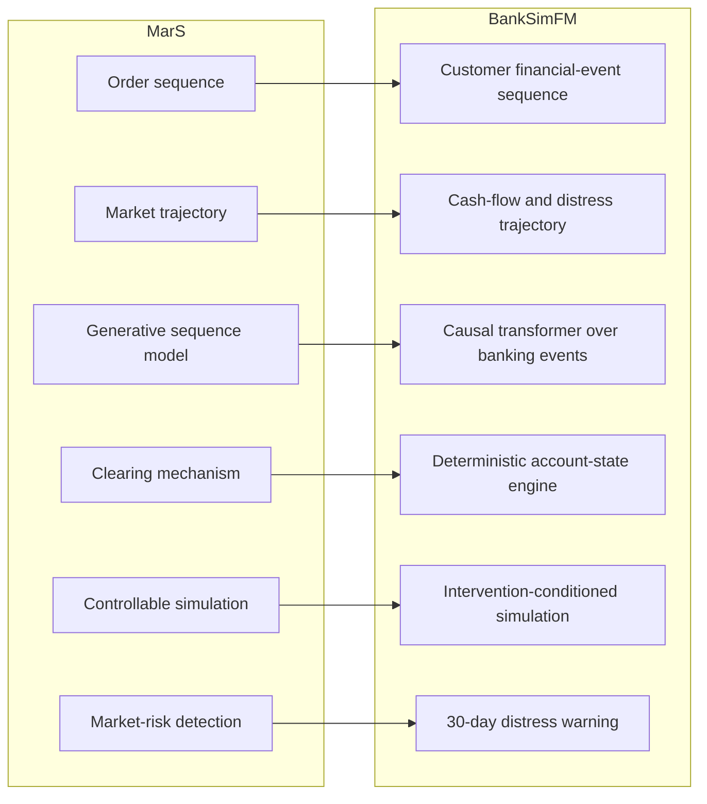
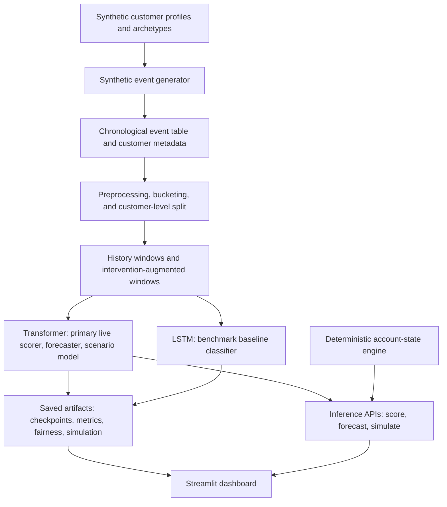
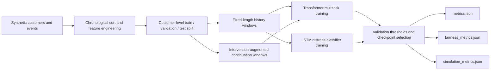
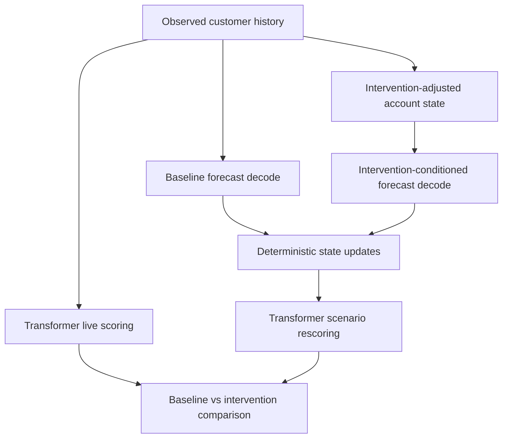
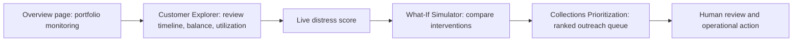
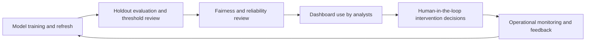
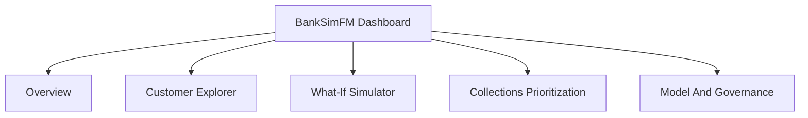
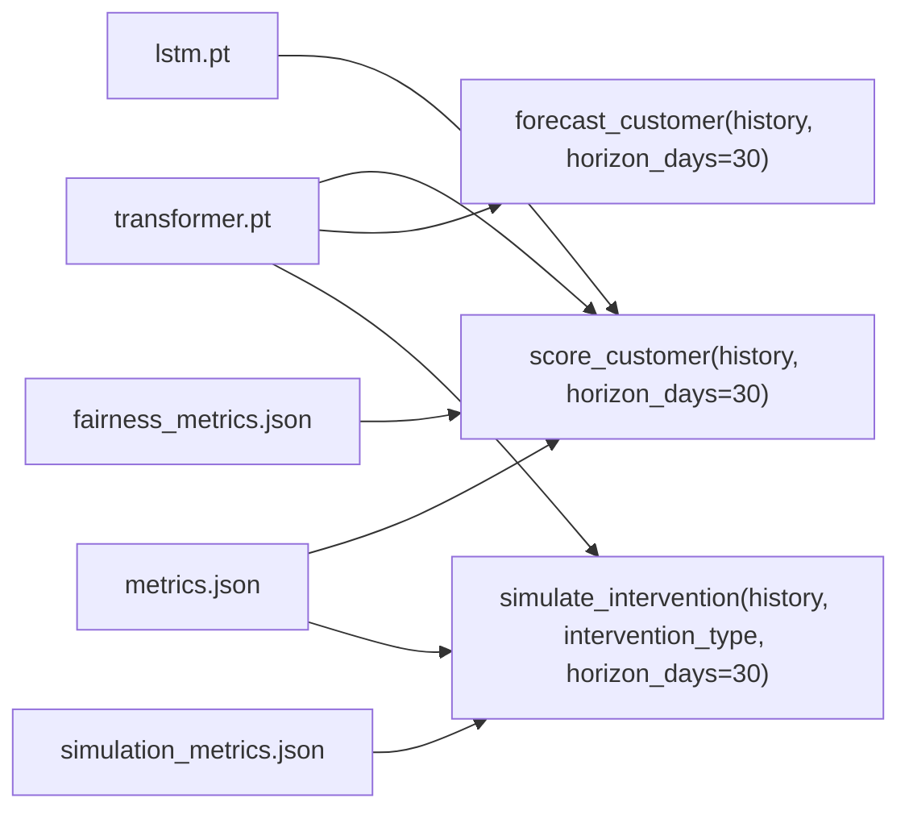

# BankSimFM Architecture And Diagram Source

This document stores the Mermaid source for the main BankSimFM figures used in the report and slides. Each section includes a caption, a short explanation, the Mermaid diagram, and the intended report reference.

## Figure 1. MarS-To-BankSimFM Concept Map

**Caption:** Conceptual mapping from the MarS financial market simulation framework to the BankSimFM retail banking prototype.

This figure explains how the project inherits MarS design ideas while changing the modeled world from markets to customer financial-event sequences. It is intended to help readers understand the innovation thesis quickly before reading implementation details.

**Referenced in report:** Section 2, *Innovation Thesis And MarS Alignment*

## Figure 2. BankSimFM System Architecture

**Caption:** End-to-end system architecture from synthetic data generation to dashboard consumption.

This figure shows the main implementation blocks that now exist in the repository, including the transformer as primary live scorer, the LSTM baseline, the deterministic engine, and the dashboard. It is the main high-level architecture figure for the report.

**Referenced in report:** Section 4, *Model Architecture And Training Approach*

## Figure 3. Training And Evaluation Flow

**Caption:** Training and evaluation flow for the transformer and LSTM models.

This figure emphasizes how raw synthetic events become model-ready windows, how the two models are trained, and how the evaluation artifacts are produced. It is useful for the methodology section and for presentation slides.

**Referenced in report:** Section 4, *Model Architecture And Training Approach*

## Figure 4. Baseline And Intervention Simulation Flow

**Caption:** Baseline and intervention simulation flow for what-if analysis.

This figure shows how observed history is scored, how baseline and intervention paths are decoded, how the deterministic state engine preserves financial consistency, and how the transformer rescoring logic supports scenario comparison.

**Referenced in report:** Section 5, *Forecasting, Scoring, And Intervention Simulation*

## Figure 5. Analyst Workflow And Collections Prioritization

**Caption:** Analyst-facing workflow across scoring, simulation, and collections prioritization.

This figure translates the technical system into a practical workflow for a risk or collections analyst. It highlights how the dashboard can move from monitoring to customer review to intervention comparison and then to ranked outreach action.

**Referenced in report:** Section 7, *Downstream Applications And Business Value*

## Figure 6. Governance And Monitoring Control Loop

**Caption:** Governance and monitoring control loop for a responsible deployment path.

This figure summarizes the report's governance position. The prototype can inform analyst decisions, but it requires fairness review, monitoring, human oversight, and periodic refresh in any real deployment scenario.

**Referenced in report:** Section 8, *Governance, Risks, And Controls*

## Figure 7. Dashboard Page Map

**Caption:** BankSimFM Streamlit dashboard page structure.

This optional figure helps presentation audiences see how the implemented prototype is organized. It is useful when giving a demo or summarizing the product surface quickly.

**Referenced in report:** Optional appendix or presentation materials

## Figure 8. Public API And Artifact Relationships

**Caption:** Relationship between the public APIs and the main saved artifacts.

This optional figure helps connect the implementation interfaces to the saved model and metric outputs. It is useful for readers who want a compact view of how runtime inference and offline evaluation relate to each other.

**Referenced in report:** Optional appendix or technical notes

